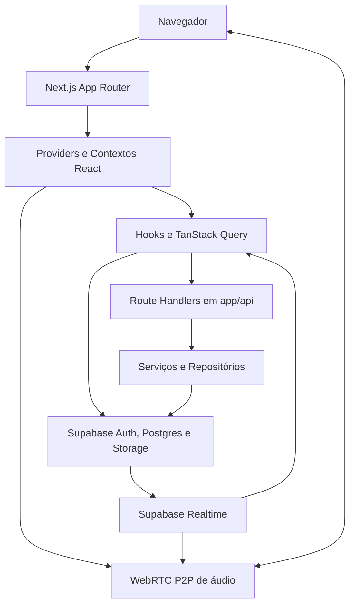

<!-- generated-by: gsd-doc-writer -->
# Arquitetura do Virtual Office

## Visão geral do sistema

O Virtual Office é uma aplicação web full-stack para equipes remotas que reúne planta virtual, salas, presença em tempo real, mensagens, chamadas de áudio e administração de empresas. A aplicação recebe interações do navegador, cookies de autenticação, requisições HTTP, eventos Realtime e mídia local; como saída, apresenta o estado do escritório e sincroniza alterações persistidas. A arquitetura é um monólito em camadas construído com Next.js 16 App Router, React 19 e TypeScript estrito: componentes e contextos formam a interface, hooks coordenam cache e efeitos, Route Handlers expõem a API, serviços e repositórios isolam regras e acesso a dados, e Supabase fornece Auth, Postgres, Realtime e Storage.

## Diagrama de componentes

As setas indicam chamadas, envio de eventos ou fluxo de mídia.



Há dois caminhos de dados no cliente. Operações sensíveis ou com autorização de aplicação passam pelos Route Handlers. Algumas consultas e assinaturas usam o cliente Supabase do navegador e dependem das políticas de Row Level Security. No servidor, os handlers criam um cliente por requisição para preservar os cookies e o contexto autenticado; o uso de `service_role` fica restrito a caminhos de servidor que também executam autorização de aplicação.

## Fluxo de dados

Um fluxo comum, como carregar e editar os espaços de uma empresa, percorre estas etapas:

1. O navegador entra por uma rota do App Router. [`src/proxy.ts`](../src/proxy.ts) valida páginas protegidas com `supabase.auth.getUser()` e atualiza cookies quando necessário; rotas `/api` fazem a própria validação no handler.
2. O layout raiz monta os providers de tema, TanStack Query, autenticação, empresa, mensagens, presença e chamadas. O layout do dashboard acrescenta proteção de rota, busca e a assinatura Realtime de espaços.
3. [`CompanyProvider`](../src/contexts/CompanyContext.tsx) carrega o perfil, a empresa, os membros e os espaços por meio do cliente HTTP em [`src/lib/api.ts`](../src/lib/api.ts). Componentes consomem esse estado sem conhecer detalhes do banco.
4. Uma mutação de espaço chama `/api/spaces`. O handler usa [`requireAuthUser`](../src/lib/auth/session.ts) para validar o JWT no servidor, resolve o usuário interno a partir de `users.supabase_uid`, confirma o escopo da empresa e delega a persistência ao `SupabaseSpaceRepository`.
5. O repositório converte entre os nomes `camelCase` da aplicação e `snake_case` do Postgres, executa a operação com o cliente Supabase recebido e devolve o modelo tipado ao handler.
6. Após o resultado HTTP, os hooks de mutação invalidam as chaves correspondentes do TanStack Query. Eventos de alteração da tabela `spaces` também invalidam o cache para que a interface refaça a leitura.
7. A nova resposta chega aos contextos e componentes; a planta virtual deriva filtros, ocupantes, permissões visuais e ações a partir desse estado.

### Presença e movimento

Presença usa um fluxo mais rigoroso porque envolve concorrência e múltiplas abas:

1. [`PresenceProvider`](../src/contexts/PresenceContext.tsx) combina registro de sessão, snapshot, Realtime, recuperação do último espaço e transições de localização.
2. [`LocationTransitionCoordinator`](../src/lib/presence/location-transition-coordinator.ts) serializa intenções de entrada, saída, reposicionamento automático e entrada aprovada por Knock. Ele envia o comando tipado a `/api/presence/location`.
3. O handler valida a sessão e chama a RPC `transition_user_location_observed`, que decide autorização, capacidade e gravação de forma atômica no banco.
4. Depois do commit, o cliente lê `/api/presence/snapshot` e substitui o cache da combinação empresa + usuário. Esse snapshot validado é a fonte de verdade para conexão e ocupação.
5. O canal Realtime privado apenas sinaliza que o snapshot deve ser relido. Reconexão, foco da janela e uma consulta periódica de 30 segundos mantêm a convergência quando um evento não chega.

### Mensagens e áudio

O [`MessagingProvider`](../src/contexts/messaging/MessagingContext.tsx) coordena a gaveta de mensagens, conversas e ações do usuário. O cliente em [`src/lib/messaging-api.ts`](../src/lib/messaging-api.ts) chama os handlers de conversas, mensagens, reações e anexos; esses handlers aplicam autenticação e autorização antes de usar os repositórios Supabase. Para áudio, [`AudioProvider`](../src/contexts/AudioContext.tsx) e [`WebRTCManager`](../src/lib/webrtc/WebRTCManager.ts) mantêm uma malha P2P entre participantes da mesma sala, enquanto Supabase Realtime transporta a sinalização de handshake, oferta, resposta e candidatos ICE.

## Abstrações principais

| Abstração | Localização | Responsabilidade |
| --- | --- | --- |
| `AuthProvider` / `useAuth` | [`src/contexts/AuthContext.tsx`](../src/contexts/AuthContext.tsx) | Expõe sessão e ações de autenticação no cliente e coordena a limpeza de presença no logout ou revogação. |
| `CompanyProvider` / `useCompany` | [`src/contexts/CompanyContext.tsx`](../src/contexts/CompanyContext.tsx) | Mantém o bootstrap e as mutações de empresa, perfil, membros e espaços, com cercas contra troca de identidade durante operações assíncronas. |
| `PresenceProvider` / `usePresence` | [`src/contexts/PresenceContext.tsx`](../src/contexts/PresenceContext.tsx) | Compõe sessão, snapshot, ocupação, movimento, recuperação e estado de conexão Realtime. |
| `MessagingProvider` / `useMessaging` | [`src/contexts/messaging/MessagingContext.tsx`](../src/contexts/messaging/MessagingContext.tsx) | Centraliza conversas, mensagens, visual ativa e comportamento da gaveta global. |
| `QueryProvider` | [`src/providers/query-provider.tsx`](../src/providers/query-provider.tsx) | Configura o `QueryClient`, políticas de cache, retry e ferramentas de desenvolvimento. |
| `LocationTransitionCoordinator` | [`src/lib/presence/location-transition-coordinator.ts`](../src/lib/presence/location-transition-coordinator.ts) | Ordena comandos de movimento, cancela intenções obsoletas, recupera sessões e reconcilia o resultado confirmado. |
| `requireAuthUser` | [`src/lib/auth/session.ts`](../src/lib/auth/session.ts) | Valida o usuário Supabase com `getUser()`, resolve o registro da aplicação e fornece o cliente autenticado aos handlers. |
| Interfaces de repositório | [`src/repositories/interfaces/`](../src/repositories/interfaces/) | Definem os contratos de acesso a usuários, empresas, espaços, mensagens, conversas, convites e bairros. |
| Repositórios Supabase | [`src/repositories/implementations/supabase/`](../src/repositories/implementations/supabase/) | Implementam os contratos, mapeiam modelos da aplicação para linhas do banco e executam consultas com o cliente injetado. |
| `WebRTCManager` | [`src/lib/webrtc/WebRTCManager.ts`](../src/lib/webrtc/WebRTCManager.ts) | Gerencia mídia local, conexões peer-to-peer, sinalização, atividade de voz e limpeza de recursos de áudio. |

## Limites arquiteturais

### Identidade e autorização

O sistema distingue dois identificadores de usuário. `auth.users.id` é o UID do Supabase Auth; `public.users.id` é o UUID da aplicação usado por chaves estrangeiras. A relação é feita por `users.supabase_uid`. Handlers devem validar o JWT com `getUser()`, resolver o usuário da aplicação e então verificar empresa, papel ou participação conforme a operação. O proxy protege navegação de páginas, mas não substitui a autorização dos Route Handlers.

### Clientes Supabase

- [`createSupabaseBrowserClient`](../src/lib/supabase/browser-client.ts) cria o cliente usado em Client Components, consultas sujeitas a RLS e assinaturas Realtime.
- [`createSupabaseServerClient`](../src/lib/supabase/server-client.ts) cria clientes por requisição e integra a renovação de cookies do App Router.
- O modo `service_role` existe apenas no servidor. Ele ignora RLS, portanto o handler ainda precisa aplicar as regras de autorização da aplicação antes de qualquer mutação.

### Cache e eventos

TanStack Query é a camada de cache de dados remotos. Hooks em `queries/` leem dados, hooks em `mutations/` executam alterações e invalidam chaves, e hooks em `realtime/` transformam eventos em invalidações. Para presença, payloads Realtime não atualizam diretamente usuários, ocupação ou permissões: somente o snapshot retornado pelo servidor pode substituir o estado autoritativo.

## Estrutura de diretórios

```text
src/
├── app/                    # Rotas, layouts, páginas e Route Handlers do App Router
├── components/             # Interface por domínio e componentes reutilizáveis
├── contexts/               # Estado React de autenticação, empresa, presença, mensagens e áudio
├── hooks/
│   ├── queries/            # Leituras e chaves do TanStack Query
│   ├── mutations/          # Escritas e invalidação de cache
│   ├── realtime/           # Assinaturas e sinalização Supabase Realtime
│   └── ui/                 # Comportamentos exclusivamente visuais
├── lib/
│   ├── api/                # Contratos e respostas HTTP compartilhados
│   ├── auth/               # Validação de sessão, autorização e métricas
│   ├── presence/           # Contratos e coordenação do subsistema de presença
│   ├── messaging/          # Transformações de cache de mensagens e reações
│   ├── services/           # Regras de aplicação que coordenam repositórios
│   ├── supabase/           # Fábricas dos clientes de navegador e servidor
│   ├── audio/              # Detecção de atividade de voz
│   └── webrtc/             # Conexões e sinalização de áudio P2P
├── providers/              # Providers de infraestrutura, como Query e tema
├── repositories/
│   ├── interfaces/         # Portas de acesso a dados
│   └── implementations/    # Adaptadores concretos, atualmente Supabase
├── types/                  # Modelos e tipos compartilhados entre camadas
└── utils/                  # Utilitários transversais pequenos

supabase/migrations/        # Histórico ordenado de migrações aplicado pelo Supabase CLI
migrations/                 # Inventário de estrutura e scripts SQL históricos do projeto
__tests__/                  # Testes unitários, de integração e contratos de presença/banco
scripts/                    # Gates, verificações e automações operacionais
public/                     # Arquivos estáticos servidos pelo Next.js
docs/                       # Documentação técnica e de produto
```

Essa organização separa composição visual, estado do cliente, orquestração de dados e persistência. Domínios com regras próprias, especialmente presença, mensagens e áudio, ficam em módulos dedicados dentro de `lib/` e são expostos à interface por contextos e hooks. As interfaces de repositório mantêm os Route Handlers e serviços desacoplados do formato físico das tabelas, enquanto os tipos compartilhados preservam os contratos entre as camadas.
