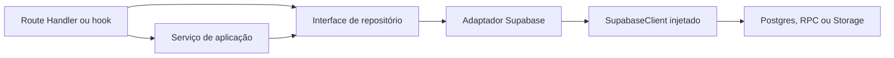

<!-- generated-by: gsd-doc-writer -->
# Serviços e repositórios

## Visão geral

As camadas em [`src/lib/services/`](../../src/lib/services/) e [`src/repositories/`](../../src/repositories/) separam regras de aplicação do acesso ao Supabase. Os serviços coordenam casos de uso, validações e efeitos auxiliares; as interfaces de repositório definem as portas tipadas; e os adaptadores em [`implementations/supabase/`](../../src/repositories/implementations/supabase/) traduzem essas portas em consultas PostgREST e RPCs. O `SupabaseClient` é criado na borda da aplicação e injetado no adaptador, portanto o mesmo repositório pode operar sob a sessão autenticada, sob RLS no navegador ou, somente depois da autorização da aplicação, com `service_role`.



Não existe um contêiner global obrigatório. Alguns consumidores usam a fábrica assíncrona [`getSupabaseRepositories`](../../src/repositories/getSupabaseRepositories.ts), enquanto outros constroem diretamente apenas os adaptadores necessários.

## Serviços de aplicação

| Serviço | Dependências | Responsabilidade e comportamento observável |
| --- | --- | --- |
| [`ConversationResolverService`](../../src/lib/services/ConversationResolverService.ts) | `IConversationRepository` autenticado, `IConversationRepository` administrativo, `IUserRepository`, `ISpaceRepository` e logger opcional | Resolve conversas diretas ou de sala. Impede conversa consigo mesmo, verifica existência e empresa dos usuários, aplica as regras de acesso da sala, calcula o fingerprint dos participantes e recupera de conflitos de unicidade `23505`. Expõe `ConversationResolverError` com status HTTP. |
| [`GoogleAvatarService`](../../src/lib/services/google-avatar-service.ts) | `IUserRepository` | Extrai URLs de avatar de dados OAuth, identifica o campo de origem, valida URLs Google, persiste ou remove `avatarUrl` e oferece operações em lote. `refreshGoogleAvatar` atualmente retorna falha porque não há gerenciamento de tokens Google para atualizar o perfil sem nova autenticação. |
| [`AvatarSyncService`](../../src/lib/services/avatar-sync-service.ts) | `IUserRepository`, `GoogleAvatarService` e `avatarCacheManager` | Coordena sincronização individual, manual, em lote ou por empresa; detecta mudança de URL e invalida o cache quando necessário. Retorna resultados estruturados em vez de propagar a maioria das falhas. |
| [`SystemMessageService`](../../src/lib/services/SystemMessageService.ts) | Singleton `messagingApi` | Fornece métodos estáticos para mensagens de entrada, saída, mudança de status, reunião e anúncio. Cria ou obtém a conversa da sala, envia uma mensagem `SYSTEM` e captura erros; por isso, esses efeitos são tratados como melhor esforço e não interrompem o fluxo chamador. |

### Contratos importantes dos serviços

`ConversationResolverService.resolve` aceita uma união discriminada:

```ts
type DirectConversationResolutionParams = {
  type: ConversationType.DIRECT;
  requesterId: string;
  targetUserId: string;
};

type RoomConversationResolutionParams = {
  type: ConversationType.ROOM;
  requesterId: string;
  roomId: string;
};
```

Para conversas diretas, o serviço ordena e deduplica os IDs, calcula um MD5 sobre a lista separada por `:` e procura `participants_fingerprint` antes de criar. Para salas, `assertRoomAccess` verifica empresa, `allowedUsers`, `allowedRoles` e privacidade. Leituras e inclusão de participantes que precisam ultrapassar RLS usam o repositório administrativo injetado; a criação usa o repositório associado à sessão.

Os construtores de `GoogleAvatarService` e `AvatarSyncService` aceitam dependências opcionais, mas o fallback atual para `IUserRepository` é apenas um objeto vazio tipado. Qualquer chamada que leia ou grave usuários deve, portanto, receber uma implementação real. O callback de autenticação segue esse padrão ao construir `GoogleAvatarService` com `SupabaseUserRepository`.

## Interfaces de repositório

As portas ficam em [`src/repositories/interfaces/`](../../src/repositories/interfaces/) e trabalham com modelos de [`src/types/`](../../src/types/), não com linhas brutas do banco.

| Interface | Operações principais |
| --- | --- |
| [`IUserRepository`](../../src/repositories/interfaces/IUserRepository.ts) | Buscar por ID da aplicação, Supabase UID, e-mail ou empresa; criar, atualizar, excluir; associar empresa; atualizar localização; listar todos. |
| [`ICompanyRepository`](../../src/repositories/interfaces/ICompanyRepository.ts) | CRUD de empresas e buscas pelas empresas administradas por um usuário. |
| [`ISpaceRepository`](../../src/repositories/interfaces/ISpaceRepository.ts) | CRUD de espaços e listagem por empresa. |
| [`ISpaceReservationRepository`](../../src/repositories/interfaces/ISpaceReservationRepository.ts) | CRUD e consultas de reservas, incluindo verificação de disponibilidade. Não há implementação Supabase correspondente no diretório atual. |
| [`IConversationRepository`](../../src/repositories/interfaces/IConversationRepository.ts) | Consultas e CRUD de conversas; participante; conversa direta por fingerprint; conversa de sala; leitura atômica; preferências por usuário e conversas fixadas. |
| [`IMessageRepository`](../../src/repositories/interfaces/IMessageRepository.ts) | CRUD e paginação de mensagens; anexos, reações, recibos de leitura, pins e estrelas. |
| [`IInvitationRepository`](../../src/repositories/interfaces/IInvitationRepository.ts) | Buscar por token, criar, alterar status e listar convites por empresa. |
| [`IAnnouncementRepository`](../../src/repositories/interfaces/IAnnouncementRepository.ts) | CRUD e paginação de anúncios por empresa. |
| [`IMeetingNoteRepository`](../../src/repositories/interfaces/IMeetingNoteRepository.ts) | CRUD e paginação de notas por sala. |
| [`INeighborhoodRepository`](../../src/repositories/interfaces/INeighborhoodRepository.ts) | CRUD de bairros, listagem por empresa e contagem de espaços associados. |
| [`IPlatformAdminRepository`](../../src/repositories/interfaces/IPlatformAdminRepository.ts) | Verificar ou obter administrador da plataforma por Supabase Auth UID. |

`src/repositories/interfaces/index.ts` reexporta todas essas portas exceto `IPlatformAdminRepository`, que hoje é importada pelo caminho direto. Esse detalhe deve ser preservado ou corrigido conscientemente ao alterar os barrels; não presuma que toda interface está disponível por `@/repositories/interfaces`.

## Implementações Supabase

Todos os adaptadores concretos recebem um `SupabaseClient` no construtor. Cada arquivo mantém suas consultas e a conversão entre a representação da aplicação e as colunas do banco. A maioria converte `snake_case` para `camelCase`; `Neighborhood`, porém, preserva nomes como `company_id`, `created_at` e `updated_at` porque esse é o contrato do tipo compartilhado atual.

| Implementação | Tabelas/RPCs confirmados | Observações |
| --- | --- | --- |
| [`SupabaseUserRepository`](../../src/repositories/implementations/supabase/SupabaseUserRepository.ts) | `users` | Mantém separados `id` e `supabase_uid`. Mapeia perfil, empresa, presença e `current_space_id`; impede persistência direta de determinados estados de presença no caminho de update. |
| [`SupabaseCompanyRepository`](../../src/repositories/implementations/supabase/SupabaseCompanyRepository.ts) | `companies` | Converte `admin_ids`, `created_at` e `settings`; as buscas por usuário consultam o array `admin_ids`. |
| [`SupabaseSpaceRepository`](../../src/repositories/implementations/supabase/SupabaseSpaceRepository.ts) | `spaces` | Converte posição, controle de acesso, template e `neighborhood_id`; reservas não fazem parte da linha de espaço. |
| [`SupabaseConversationRepository`](../../src/repositories/implementations/supabase/SupabaseConversationRepository.ts) | `conversations`, `conversation_members`; RPCs `get_unread_counts` e `mark_conversation_read` | Anexa preferências e contagem de não lidas na leitura por usuário. `create` insere um UUID e só depois relê a conversa, permitindo que o trigger de membership conclua antes da leitura sob RLS. |
| [`SupabaseMessageRepository`](../../src/repositories/implementations/supabase/SupabaseMessageRepository.ts) | `messages`, `message_attachments`, `message_reactions`, `message_read_receipts`, `pinned_messages`, `starred_messages` | Enriquece mensagens com dados relacionados. Caminhos de anexos privados são expostos como `/api/messages/attachment/{id}` em vez de devolver diretamente o caminho do Storage. |
| [`SupabaseInvitationRepository`](../../src/repositories/implementations/supabase/SupabaseInvitationRepository.ts) | `invitations` | Converte timestamps de expiração e cria convites inicialmente como `pending`. |
| [`SupabaseAnnouncementRepository`](../../src/repositories/implementations/supabase/SupabaseAnnouncementRepository.ts) | `announcements` | CRUD e paginação por offset, ordenada por `timestamp` decrescente. |
| [`SupabaseMeetingNoteRepository`](../../src/repositories/implementations/supabase/SupabaseMeetingNoteRepository.ts) | `meeting_notes` | CRUD e paginação por sala, ordenada por `meeting_date` decrescente. |
| [`SupabaseNeighborhoodRepository`](../../src/repositories/implementations/supabase/SupabaseNeighborhoodRepository.ts) | `neighborhoods`, `spaces` | CRUD de bairros e `count` head-only dos espaços por `neighborhood_id`. |
| [`SupabasePlatformAdminRepository`](../../src/repositories/implementations/supabase/SupabasePlatformAdminRepository.ts) | `platform_admins` | `user_id` recebe o Supabase Auth UID. As consultas administrativas convertem falha para `false` ou `null`, em vez de propagá-la. |

Ausência de linha costuma resultar em `null` nos métodos de busca unitária. Erros inesperados são geralmente propagados, mas operações booleanas e `SupabasePlatformAdminRepository` têm semântica mais tolerante. O consumidor deve seguir o contrato do método específico, não assumir uma política de erro uniforme para todos os adaptadores.

## Limites de construção e autorização

### Cliente do navegador

[`createSupabaseBrowserClient`](../../src/lib/supabase/browser-client.ts) usa as variáveis públicas e o contexto da sessão no navegador. [`useSpaces`](../../src/hooks/queries/useSpaces.ts) é um exemplo de repositório construído com esse cliente. Leituras e escritas nesse caminho dependem das políticas RLS.

### Cliente autenticado do servidor

[`requireAuthUser`](../../src/lib/auth/session.ts) cria o cliente SSR com cookies, valida o JWT por `auth.getUser()` e resolve o registro de `users` por `supabase_uid`. Route Handlers podem usar o `supabase` retornado para construir repositórios que devem respeitar o contexto autenticado:

```ts
const auth = await requireAuthUser();
if ('errorResponse' in auth) return auth.errorResponse;

const companyRepository: ICompanyRepository =
  new SupabaseCompanyRepository(auth.supabase);
```

O UID de `auth.getUser()` e o `users.id` retornado em `auth.dbUser.id` não são intercambiáveis. Chaves estrangeiras da aplicação, participantes de conversa e IDs enviados aos repositórios de domínio usam `users.id`; buscas de autenticação usam `users.supabase_uid`. `IPlatformAdminRepository` é a exceção explícita cujo argumento é o Auth UID.

### Cliente `service_role`

[`createSupabaseServerClient('service_role')`](../../src/lib/supabase/server-client.ts) usa `SUPABASE_SERVICE_ROLE_KEY`, desabilita persistência e renovação de sessão e ignora RLS. Por isso, a criação desse cliente deve permanecer em código de servidor e ocorrer depois que o handler autenticar o usuário e validar participação, empresa, papel ou acesso ao recurso. O repositório não substitui essa autorização.

O handler [`POST /api/conversations/resolve`](../../src/app/api/conversations/resolve/route.ts) mostra uma composição com dois clientes: a criação da conversa usa o cliente autenticado; buscas auxiliares e inclusão de participante recebem adaptadores construídos com `service_role`, depois de `requireAuthUser`, e as regras de acesso ficam no serviço.

### Fábrica parcial

[`getSupabaseRepositories`](../../src/repositories/getSupabaseRepositories.ts) recebe o cliente escolhido pelo chamador e carrega adaptadores dinamicamente para evitar efeitos colaterais durante testes. Ela retorna hoje:

- mensagem;
- conversa;
- usuário;
- espaço;
- empresa;
- bairro;
- administrador da plataforma.

Convite, anúncio e nota de reunião têm adaptadores, mas não fazem parte dessa fábrica. Reserva tem interface, mas não tem adaptador Supabase. O barrel [`src/repositories/implementations/supabase/index.ts`](../../src/repositories/implementations/supabase/index.ts) reexporta os adaptadores existentes exceto `SupabasePlatformAdminRepository`, que também é importado diretamente.

## Exemplos de uso

### Injetar portas em um serviço

```ts
const resolver = new ConversationResolverService({
  conversationRepository: new SupabaseConversationRepository(auth.supabase),
  adminConversationRepository: new SupabaseConversationRepository(serviceClient),
  userRepository: new SupabaseUserRepository(serviceClient),
  spaceRepository: new SupabaseSpaceRepository(serviceClient),
});

const conversation = await resolver.resolve({
  type: ConversationType.DIRECT,
  requesterId: auth.dbUser.id,
  targetUserId,
});
```

Essa composição mantém a regra de negócio testável sem Supabase. Os testes de [`ConversationResolverService`](../../__tests__/conversation-resolver.test.ts) fornecem objetos que satisfazem apenas os métodos usados pelo caso de teste.

### Usar a fábrica quando vários adaptadores compartilham o cliente

```ts
const supabase = await createSupabaseServerClient();
const { messageRepository, conversationRepository } =
  await getSupabaseRepositories(supabase);
```

A fábrica não decide o nível de privilégio. Essa decisão pertence ao chamador que criou `supabase`.

## Como estender com segurança

1. Defina ou reutilize primeiro o modelo de domínio em `src/types/`. Mantenha detalhes de linha Supabase dentro do adaptador.
2. Adicione o menor contrato necessário em `src/repositories/interfaces/`. Um serviço deve depender da interface, não de `Supabase*Repository`.
3. Implemente o contrato com um `SupabaseClient` injetado. Converta explicitamente nomes de coluna, datas, nulos e valores padrão nos dois sentidos.
4. Preserve a diferença entre `users.id` e `users.supabase_uid`. Documente no nome do parâmetro quando uma operação realmente recebe Auth UID.
5. Escolha o cliente no ponto de composição. Prefira o cliente autenticado; use `service_role` apenas em servidor, depois de autorização explícita, e injete-o somente nos adaptadores que precisam do privilégio.
6. Atualize o barrel correspondente somente se o novo contrato fizer parte daquela superfície pública. Inclua o adaptador em `getSupabaseRepositories` apenas quando consumidores realmente precisarem dele na fábrica.
7. Preserve a semântica do contrato: diferencie “não encontrado”, falha de infraestrutura e retorno booleano. Não transforme silenciosamente um erro de banco em ausência, salvo quando a interface já estabelecer esse comportamento.
8. Para invariantes concorrentes ou operações atômicas, use um RPC ou restrição do banco e mantenha no serviço apenas a coordenação. O resolver de conversas combina restrição única, código `23505` e nova leitura; a marcação de leitura usa `mark_conversation_read`.
9. Teste o serviço com fakes/mocks das interfaces e teste o adaptador separadamente com um `SupabaseClient` simulado ou um ambiente de integração. Cubra mapeamento, ausência de linha, erro do cliente e qualquer código de conflito que o serviço interprete.
