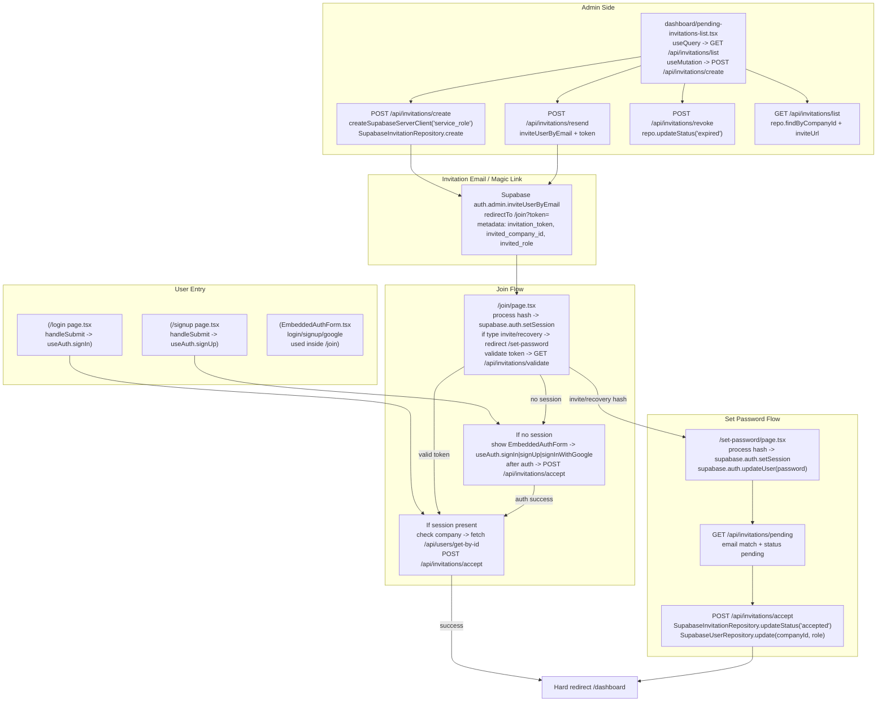

# Auth + Invitation Workflow Map

_Status: reference document for debugging the login/signup/invite flows. Generated on 2025-12-10._

## Scope & existing references (anti-duplication)
- Existing invitation docs: `docs/sprint-artifacts/2-2-invitation-accept-flow.md`, `docs/sprint-artifacts/hotfix-epic2-invitation-flow.md`, `docs/sprint-artifacts/2-3-invitation-link-copy-limit.md`.
- System audits: `memory-bank/specs/system-audit-and-cleanup/invitation-consolidation-plan.md`, `memory-bank/specs/system-audit-and-cleanup/invitation-system-git-analysis.md`.
- This file consolidates **current code paths** across auth + invitations; use it alongside the above historical notes.

## High-level flow (Mermaid)

## Entry points & UI flows
- `src/app/(auth)/login/page.tsx`
  - `handleSubmit` -> `useAuth.signIn` (password); Google via `useAuth.signInWithGoogle`.
  - On success redirects to `/onboarding` if user+company resolved.
  - Resend confirmation for unconfirmed email via `supabase.auth.resend`.
- `src/app/(auth)/signup/page.tsx`
  - `handleSubmit` -> `useAuth.signUp`; shows `EmailConfirmationMessage` on success.
  - Google sign-up via `useAuth.signInWithGoogle` then `router.push('/onboarding')`.
- `src/components/auth/EmbeddedAuthForm.tsx`
  - Modes: signup/login/set-password (invite prefill).
  - Calls `useAuth.signIn` / `useAuth.signUp` / `useAuth.signInWithGoogle`.
  - Invite-specific: resend invite email via `supabase.auth.resetPasswordForEmail` (magic link) using current URL as redirect.
- `src/app/join/page.tsx`
  - Steps: process hash from Supabase (sets session, may redirect to `/set-password` for invite/recovery); validate token via `GET /api/invitations/validate`; if session exists, check company via `/api/users/get-by-id`; auto `POST /api/invitations/accept`; otherwise render `EmbeddedAuthForm` to login/signup then accept.
  - Guards for expired/used tokens, already-in-company, missing token.
- `src/app/(auth)/set-password/page.tsx`
  - Process hash to set session; `supabase.auth.updateUser({ password })`; then `GET /api/invitations/pending` and auto `POST /api/invitations/accept` if present; hard-redirect to `/dashboard` when accepted, otherwise `/onboarding` or stored return URL.
- `src/components/dashboard/pending-invitations-list.tsx`
  - Admin UI: `useQuery` GET `/api/invitations/list`; `useMutation` POST `/api/invitations/create`, `/api/invitations/resend`, `/api/invitations/revoke`; copy invite link.
- `src/app/admin/invitations/page.tsx`
  - Renders `PendingInvitationsList`.
- `src/app/platform-admin/page.tsx`
  - Platform admin path also creates company + invitation via `/api/platform-admin/create-company` (uses `SupabaseInvitationRepository.create`).

## API endpoints & behaviors
- `POST /api/invitations/create`
  - Auth: requires user admin of `companyId`.
  - Uses `createSupabaseServerClient('service_role')` to call `supabase.auth.admin.inviteUserByEmail` (redirect `/join?token=…`).
  - Records invitation via `SupabaseInvitationRepository.create`; enforces 10-user limit (users + pending invitations).
- `POST /api/invitations/resend`
  - Auth: admin of invitation company.
  - Re-sends via `auth.admin.inviteUserByEmail` with stored `token`.
- `GET /api/invitations/list`
  - Auth: admin of `companyId`.
  - Uses `repo.findByCompanyId`; returns `inviteUrl`, counts, remaining capacity.
- `POST /api/invitations/revoke`
  - Auth: admin of invitation company.
  - Marks status `expired` via `repo.updateStatus`; attempts to delete unconfirmed auth user (if exists).
- `GET /api/invitations/validate`
  - Public validation by token; checks status/expiry, returns `email`, `companyName`, `companyId`; updates status to expired when past `expires_at`.
- `GET /api/invitations/pending`
  - Auth: current user email; returns latest pending invite for email (status pending and not expired) with `companyName`, `companyId`, `role`.
- `POST /api/invitations/accept`
  - Auth: requires session; validates token (pending + not expired); enforces email match with `authUser.email`.
  - If user already has different company -> 409; else uses `SupabaseUserRepository.update` to set `companyId` & `role`; marks invitation accepted via `repo.updateStatus`.
- `POST /api/platform-admin/create-company`
  - Creates company and invitation (admin role) using `SupabaseInvitationRepository.create`; sends invite email through Supabase Auth.

## Key shared services
- `src/contexts/AuthContext.tsx`
  - `signIn` -> `supabase.auth.signInWithPassword`.
  - `signUp` -> `supabase.auth.signUp` then `syncUserProfile`.
  - `signInWithGoogle` -> `supabase.auth.signInWithOAuth` redirect to `/api/auth/callback`.
  - `signOut` -> updates user status via `/api/users/update` then `supabase.auth.signOut`.
- `src/repositories/implementations/supabase/SupabaseInvitationRepository.ts`
  - `findByToken`, `create`, `updateStatus`, `findByCompanyId` (maps snake_case to camelCase, converts dates to ms/ISO).
- `src/repositories/interfaces/IInvitationRepository.ts`
  - Interface for the above.

## Observations & likely bug hotspots
- Multiple hash-processing paths (join + set-password) rely on Supabase magic-link tokens; double-processing guarded by `hashProcessed`/`flowExecuted` flags.
- Accept flow trusts `authUser.email`; mismatch returns 403 and leaves invitation pending.
- Revoke tries to delete unconfirmed Auth user but ignore failure; pending invite may stay expired yet Auth user may exist.
- Hard navigations (`window.location.href`) are used to refresh contexts after accept/password-set; stale contexts can occur if these redirects are bypassed.
- 10-user limit check counts `(users + pending invitations)`; any divergence between Auth and DB (email sent but DB insert failed) is surfaced but manual cleanup may be required.
- Invitation expiration stored as ms (repository) vs. TIMESTAMPTZ in DB; ensure conversions stay aligned when debugging expiry issues.

## How to trace end-to-end
1) Admin sends invite (PendingInvitationsList → POST /api/invitations/create) and shares `/join?token=…`.
2) Invitee clicks email → Supabase sets session via hash → `/join` processes hash → if needed `/set-password` → `GET /api/invitations/validate` → `POST /api/invitations/accept` → hard redirect `/dashboard`.
3) If invitee opens link without session, `/join` shows `EmbeddedAuthForm`; after login/signup (or Google) accept is called with same token.
4) If password set later, `/set-password` re-checks via `GET /api/invitations/pending` and auto-accepts.

_Status: Pending user confirmation._
