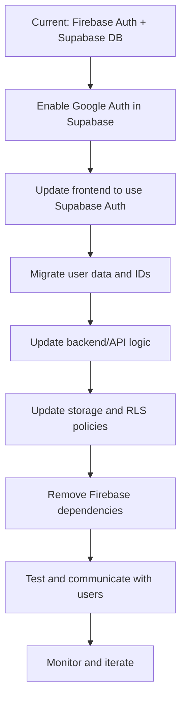

# Migration Plan: Move from Firebase Auth to Supabase Auth (with Google Login)

This document provides a step-by-step plan to migrate your authentication system from Firebase Auth to Supabase Auth, using Google as the login provider. The goal is to simplify your stack, unify authentication and database access, and reduce maintenance complexity.

---

## 1. Preparation

- **Backup your database and user data.**
- Review your current user model: note how Firebase UIDs are mapped to your Supabase users table.
- Audit all places in your codebase that use Firebase Auth (login, session, user info, etc).

---

## 2. Enable Google Auth in Supabase

1. Go to your [Supabase Project Dashboard](https://app.supabase.com/).
2. Navigate to **Authentication > Providers**.
3. Enable **Google** and provide your Google OAuth credentials (Client ID and Secret).
   - [Google Cloud Console: Create OAuth credentials](https://console.cloud.google.com/apis/credentials)
4. Save changes.

---

## 3. Update Your Frontend to Use Supabase Auth

- Install Supabase JS client if not already present:
  ```bash
  npm install @supabase/supabase-js
  ```
- Replace Firebase Auth logic with Supabase Auth logic:
  - Use `supabase.auth.signInWithOAuth({ provider: 'google' })` for login.
  - Use `supabase.auth.getUser()` and `supabase.auth.onAuthStateChange()` for session management.
- Remove Firebase Auth imports and initialization.

---

## 4. Migrate User Data

- **If your users are already in Supabase:**  
  - Ensure their `id` matches the Supabase Auth UID (not Firebase UID).
  - If you have a mapping table (`auth_id` or similar), update it to use Supabase UIDs.
- **If you need to migrate users:**  
  - Export user emails from Firebase.
  - Invite users to sign in with Google via Supabase (they will create new Supabase Auth accounts).
  - Optionally, write a migration script to map old Firebase UIDs to new Supabase UIDs in your database.

---

## 5. Update Backend/API Logic

- Replace all Firebase Auth session validation with Supabase Auth session validation.
- Use Supabase's built-in session and JWT validation for API routes.
- Remove any Firebase Admin SDK usage.

---

## 6. Update Storage and RLS Policies

- Ensure Supabase Storage and Row Level Security (RLS) policies use the new Supabase Auth UIDs.
- Update any storage bucket rules to reference `auth.uid()`.

---

## 7. Remove Firebase Dependencies

- Remove all Firebase packages from your `package.json`.
- Delete Firebase config files and environment variables.

---

## 8. Test Thoroughly

- Test login, logout, and session persistence.
- Test all database operations that require authentication.
- Test file uploads and access control.
- Test user profile updates (e.g., avatar upload).

---

## 9. Communicate with Users

- Notify users of the change (if needed).
- If users need to re-authenticate, provide clear instructions.

---

## 10. Monitor and Iterate

- Monitor Supabase Auth logs for errors.
- Gather user feedback and address any issues.

---

## Migration Flow Diagram



---

## References

- [Supabase Auth Docs](https://supabase.com/docs/guides/auth)
- [Supabase Google Auth Guide](https://supabase.com/docs/guides/auth/social-login/google)
- [Migrating from Firebase to Supabase](https://supabase.com/docs/guides/migrations/firebase)

---

**After completing this migration, your app will use Supabase for both authentication and database operations, greatly simplifying your stack and reducing the risk of session errors.**