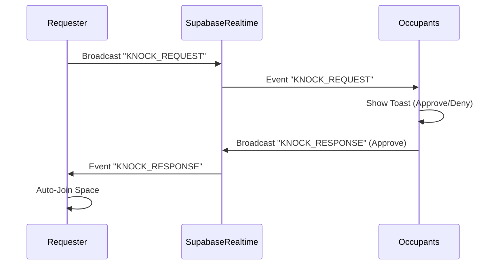

# Story 3.16: Knock to Enter Workflow

Status: in-progress

## Story

As a user,
I want to request access to restricted spaces by "knocking",
So that I can join private meetings when appropriate.

## Acceptance Criteria

1. **AC1 – "Knock" Button for Restricted Spaces**
   - Restricted/Private spaces show "Knock" button instead of "Join" in `SpaceDetailPanel` and `SpaceActionButtons`.
   - "Join" button is hidden/replaced for non-members of the private space.
   - [Source: docs/epics.md#story-3.16-knock-to-enter-workflow]

2. **AC2 – Knock Signal & Notification**
   - Clicking "Knock" sends a realtime signal to ALL users currently inside the space.
   - Occupants receive a toast notification: "User X is knocking..."
   - Notification plays a subtle sound (if enabled).
   - [Source: docs/epics.md#story-3.16-knock-to-enter-workflow]

3. **AC3 – Approve/Deny Actions**
   - Toast notification includes "Approve" and "Deny" buttons.
   - ANY occupant in the space can approve or deny.
   - Action is logged (who approved/denied).
   - [Source: docs/epics.md#story-3.16-knock-to-enter-workflow]

4. **AC4 – Auto-Join on Approval**
   - If approved, the requester is automatically joined to the space (auto-transition).
   - Requester receives success toast: "Access granted".
   - [Source: docs/epics.md#story-3.16-knock-to-enter-workflow]

5. **AC5 – Access Denied Handling**
   - If denied, requester receives specific toast: "Access denied".
   - Requester cannot knock again on the same space for 1 minute (cooldown).
   - [Source: docs/epics.md#story-3.16-knock-to-enter-workflow]

6. **AC6 – Pending State & Timeout**
   - While waiting, "Knock" button changes to "Knocking..." (disabled).
   - Request times out after 30 seconds if no response.
   - Requester notified of timeout.
   - [Source: docs/epics.md#story-3.16-knock-to-enter-workflow]

7. **AC7 – Theme & Accessibility**
   - Knock notifications follow the current theme (Neon, Zen, etc.).
   - Sound and visual cues are accessible (aria-live region updates).
   - [Source: docs/ux-design-specification.md#priority-3.16]

## Tasks / Subtasks

### Task 1: Knock Logic Client-Side (AC1, AC6)
- [x] 1.1 Create `src/hooks/useKnock.ts`:
  - Manage knock state (idle, pending, approved, denied).
  - Handle cooldown timer.
  - Return `knock()` function and `status`.
- [x] 1.2 Modify `ModernFloorPlan.tsx`:
  - Integrate `useKnock`.
  - Pass `onKnock` handler to `ModernSpaceCard`.
- [x] 1.3 Modify `ModernSpaceCard.tsx` implies:
  - Prop drill `onKnock` to `SpaceDetailPanel`.

### Task 2: Realtime Signaling (AC2, AC3)
- [x] 2.1 Create/Modify `src/hooks/realtime/useKnockSignaling.ts`:
  - Listen for `knock_request` events on the space channel.
  - Listen for `knock_response` events (private channel or user specific).
- [x] 2.2 Backend/Edge Function (optional if pure P2P/Realtime):
  - Ideally, use Supabase Realtime Broadcast for "Knock".
  - Payload: `{ type: 'KNOCK', requesterId, requesterName, spaceId }`.
  - Implemented `POST /api/spaces/knock/respond` to validate occupant permissions and broadcast server-validated responses.

### Task 3: Occupant Notification UI (AC2, AC3)
- [x] 3.1 Create `KnockToast` component (or use `sonner` custom toast):
  - Display "User X is knocking".
  - Buttons: "Let in" | "Deny".
- [x] 3.2 Integrate with `useKnockSignaling` to trigger toast for occupants.
- [x] 3.3 Handle button clicks: send `KNOCK_RESPONSE` signal.
  - Payload: `{ type: 'RESPONSE', decision: 'APPROVE' | 'DENY', responderId }`.

### Task 4: Requester Response Handling (AC4, AC5, AC6)
- [x] 4.1 Handle `KNOCK_RESPONSE` in `useKnock`.
- [x] 4.2 If APPROVED: Trigger `handleEnterSpace(spaceId)`.
- [x] 4.3 If DENIED: Show "Denied" toast, start cooldown.
- [x] 4.4 If TIMEOUT: Reset state, show "No response" toast.

### Task 5: Testing (AC7)
- [x] 5.1 Unit test `useKnock` state machine - 11 tests pass.
- [x] 5.2 Test `KnockToast` rendering and interactions - 10 tests pass.
- [x] 5.3 Test `SpaceActionButtons` knock states (default/knocking/cooldown) - 4 tests pass.
- [x] 5.4 Type-check passes.

## Architecture & Data Flow

## Learnings from Previous Stories
- **Story 3.11**: `SpaceActionButtons` already has the UI "shell" for Knock. We just need to wire it up.
- **Story 3.12**: Error handling for "Full" spaces uses toasts. We should use the same pattern for "Denied".
- **Realtime**: We reuse the existing `rooms` channel or `presence` channel pattern. Using Broadcast is lightest weight.

## Dev Notes
- **Security Check**: This is a client-side "social" lock. For true security, RLS policies prevents reading data, but "joining" is often just a presence update. Ensure the backend *also* checks permission if possible, or rely on the fact that without the "Approve" signal, the client won't attempt the join.
  - *Refinement*: The `handleEnterSpace` calls `updateLocation`. We might want to ensure `updateLocation` respects private spaces, but for this story, we focus on the workflow.
- **Sound**: Use a simple "knock.mp3" or similar short ease-in sound.

## Dev Agent Record

### File List
- `src/hooks/useKnock.ts`
- `src/hooks/realtime/useKnockSignaling.ts`
- `src/app/api/spaces/knock/respond/route.ts`
- `src/components/floor-plan/modern/ModernFloorPlan.tsx`
- `src/components/floor-plan/modern/ModernSpaceCard.tsx`
- `src/components/floor-plan/modern/SpaceDetailPanel.tsx`
- `src/components/floor-plan/modern/SpaceDetailBottomSheet.tsx`
- `src/components/floor-plan/modern/SpaceActionButtons.tsx`
- `__tests__/components/floor-plan/modern/SpaceActionButtons.test.tsx`

### Validation
- `npm run type-check` passes.
- `npx vitest run __tests__/hooks/useKnock.test.ts __tests__/components/floor-plan/modern/KnockToast.test.tsx __tests__/components/floor-plan/modern/SpaceActionButtons.test.tsx` passes (`25` tests).

### Notes
- Updated interaction behavior per product decision: users can knock any space by default.
- Occupant approve/deny now goes through server validation route and logs the action as a system message in the room conversation when available.

## Change Log
- 2026-02-09: Applied adversarial review fixes for pending/cooldown state UX, timeout handling, server-validated response flow, response action logging, notification sound cue, and added `SpaceActionButtons` tests.
- 2026-02-09: Fixed realtime knock delivery race by waiting for channel `SUBSCRIBED` before broadcast send in both client request and server response paths.
- 2026-02-09: Moved knock request broadcast to server endpoint (`/api/spaces/knock/request`) with DB-based recipient count to diagnose occupant visibility vs realtime delivery.
- 2026-02-09: Added explicit knock listener channel status telemetry (`occupiedChannelStatus`) to surface silent subscription failures in UI.
