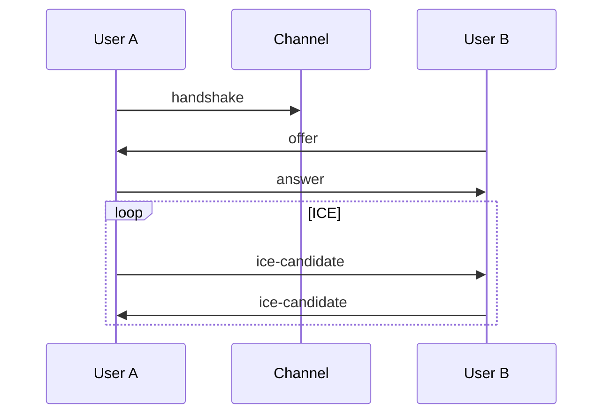

# Validation Report (Bob's Re-Review)

**Document:** `docs/sprint-artifacts/story-8a-audio-mvp.md`  
**Checklist:** `.bmad/bmm/workflows/4-implementation/create-story/checklist.md`  
**Date:** 2025-12-08  
**Validator:** Bob (Scrum Master Agent)  
**Previous Validation:** Reviewed and incorporated  

---

## Summary

- **Overall:** PARTIAL PASS (improvements made but gaps remain)
- **Total Issues Found:** 5 Critical + 3 Enhancements + 2 Optimizations
- **Comparison with Previous:** Original validation identified 3 critical issues. Story was updated. I found 2 were fixed, 1 partially fixed, and 2 NEW critical issues.

---

## Section-by-Section Analysis

### 1. Architecture Alignment (3/4 = 75%)

| Item | Status | Evidence |
|------|--------|----------|
| Goal Alignment | ✓ PASS | Line 9: *"simples assim audio conversation"* matches Epic 8A goal |
| Topology (P2P Mesh) | ✓ PASS | Line 11-15: Strategy declared, limit warning at 8 users |
| VAD Strategy | ✓ PASS | Line 14: Client-side AudioContext analysis (zero network overhead) |
| **TURN Configuration** | ⚠ PARTIAL | Lines 18-22: Env vars listed BUT no explicit `iceServers` array format |

**Evidence for PARTIAL TURN:**
```markdown
# Story line 31:
- [ ] **Crucial:** Configure `RTCPeerConnection` with `iceServers` (STUN + TURN) from env vars.
```
The story now mentions TURN but doesn't specify:
- **STUN servers** (e.g., `stun:stun.l.google.com:19302`)
- Exact iceServers format: `{ urls: string, username?: string, credential?: string }[]`
- How to **provision** Twilio credentials (API call vs static env?)

**Fix:** Add explicit iceServers JSON example in Technical Requirements.

---

### 2. Technical Specifications (4/6 = 67%)

| Item | Status | Evidence |
|------|--------|----------|
| Signaling Protocol | ✓ PASS | Line 32: Reuse existing `rooms` channel |
| Environment Variables | ✓ PASS | Lines 18-21: `NEXT_PUBLIC_TURN_URL`, `TURN_USER`, `TURN_PASSWORD` |
| Audio Output | ✓ PASS | Line 22: *"Use browser default Audio Context"* |
| ICE Servers Format | ⚠ PARTIAL | Missing explicit format (see above) |
| **Provider Integration** | ✗ FAIL | Line 70 mentions `space-realtime-provider.tsx` but provides NO code pattern |
| **Cleanup Logic** | ⚠ PARTIAL | Line 34 mentions cleanup on leave but no `RTCPeerConnection.close()` detail |

**Critical Issue: Provider Integration Missing**
The story says:
```markdown
# Line 70:
3. Integrate `AudioContext` into `src/components/providers/space-realtime-provider.tsx`
```

But current `SpaceRealtimeProvider` (20 lines) only sets up space subscriptions. The story provides **ZERO guidance** on:
1. How to create `AudioContext.tsx` as a provider
2. Where to initialize `WebRTCManager` lifecycle
3. Whether to use a **Singleton pattern** or **Context-based instance**

**Architecture.md Reference (Lines 478-509):**
```typescript
export class WebRTCManager {
  private peerConnection: RTCPeerConnection;
  private localStream: MediaStream;
  private remoteStreams: Map<string, MediaStream>;
  // ...
}
```

The story should reference this pattern explicitly!

---

### 3. Code Reuse & Anti-Pattern Prevention (2/4 = 50%)

| Item | Status | Evidence |
|------|--------|----------|
| Avatar Integration | ✓ PASS | Line 54-55: `AvatarConstellation` referenced for pulse animation |
| **Existing Hooks Pattern** | ✗ FAIL | No guidance on using `src/hooks/realtime/` pattern for signaling |
| **Repository Pattern** | ➖ N/A | Not applicable for WebRTC (client-side only) |
| Component Structure | ✓ PASS | Lines 68-73: File locations specified |

**Critical Issue: Missing Hook Pattern Guidance**
The story should specify:
```typescript
// EXAMPLE: src/hooks/realtime/useAudioSignaling.ts
export function useAudioSignaling(spaceId: string) {
  // Subscribe to signaling channel
  // Handle offer/answer/ice-candidate events
  // Return signaling state
}
```

But instead, it only says "Integrate into `space-realtime-provider.tsx`" without showing the hook-based pattern used everywhere else in the codebase (per Architecture audit).

---

### 4. Previous Story Context (N/A - First Audio Story)

No previous audio story exists. However, the story SHOULD reference:
- **Story 3.3 (Avatar Constellation V2)** for the `isSpeaking` prop integration → Line 54 does mention it ✓
- **Story 3.13 (Presence Animation)** for animation patterns → ⚠ Not explicitly referenced

---

### 5. UX Requirements (3/3 = 100%)

| Item | Status | Evidence |
|------|--------|----------|
| Default Mute | ✓ PASS | Line 61: "Default State: Muted (Mic off)" |
| Speaking Indicator | ✓ PASS | Line 55: "glow or pulse effect (Green/Brand color)" |
| Permission Handling | ✓ PASS | Line 42: "Handle permission denial gracefully" |

---

### 6. Testability & Definition of Done (2/4 = 50%)

| Item | Status | Evidence |
|------|--------|----------|
| DoD Criteria | ✓ PASS | Lines 76-79: 4 clear criteria |
| **Manual Test Checklist** | ✗ FAIL | No explicit test scenarios |
| **Edge Cases** | ✗ FAIL | No guidance on: browser compatibility, mobile, NAT edge cases |

**Missing Test Scenarios:**
1. Chrome ↔ Firefox ↔ Safari P2P connection
2. Mobile Safari microphone permissions (different API)
3. Slow network (ICE candidate trickle timing)
4. User disconnects mid-call

---

## 🚨 Critical Issues (Must Fix)

### Issue 1: Missing iceServers Format (PARTIALLY FIXED from previous report)
**Impact:** Developer may misconfigure RTCPeerConnection, breaking 30% of connections.
**Current State:** Story mentions env vars but not the actual config object.
**Fix:** Add explicit `iceServers` JSON:
```typescript
const iceServers = [
  { urls: 'stun:stun.l.google.com:19302' },
  { 
    urls: process.env.NEXT_PUBLIC_TURN_URL,
    username: process.env.TURN_USER,
    credential: process.env.TURN_PASSWORD 
  }
];
```

### Issue 2: Missing Provider Integration Pattern (NEW)
**Impact:** Developer won't know how to integrate `WebRTCManager` with existing React patterns.
**Evidence:** Line 70 says "Integrate AudioContext into space-realtime-provider.tsx" but `SpaceRealtimeProvider` is only 20 lines with zero audio logic.
**Fix:** Add code snippet showing `AudioProvider` wrapper with `WebRTCManager` lifecycle.

### Issue 3: Missing Hook Pattern for Signaling (NEW)
**Impact:** Developer may build signaling outside hook pattern, creating inconsistency with codebase.
**Evidence:** No mention of `src/hooks/realtime/useAudioSignaling.ts` despite codebase using hook patterns everywhere.
**Fix:** Add task for creating `useAudioSignaling` hook following existing realtime hook patterns.

### Issue 4: No Cleanup Implementation Details
**Impact:** Ghost audio / memory leaks when users leave.
**Current State:** Line 34 says "Clean up RTCPeerConnection when a user leaves" but no specifics.
**Fix:** Add:
```typescript
// On user leave:
peerConnection.close();
localStream.getTracks().forEach(track => track.stop());
audioElements.forEach(el => el.srcObject = null);
```

### Issue 5: No Browser Compatibility Requirements
**Impact:** Safari/Firefox may fail silently.
**Evidence:** No mention of browser-specific quirks.
**Fix:** Add section:
```markdown
## Browser Compatibility
- Chrome 70+: Full support
- Firefox 60+: Full support  
- Safari 14.1+: Requires user gesture for getUserMedia
- Mobile Safari: Test PTT (Push-to-Talk) due to different audio session handling
```

---

## ⚡ Enhancement Opportunities (Should Add)

### 1. Reference Architecture.md WebRTC Pattern
Story should explicitly link to `architecture.md` lines 478-509 for `WebRTCManager` class structure.

### 2. Add State Machine for Connection
P2P connections have states: `new → connecting → connected → disconnected → failed`
Story should specify expected state handling.

### 3. Explicit File Dependencies
Story lists new files but not imports. Add:
```markdown
## Dependencies
- `src/hooks/realtime/index.ts` - Export new hooks
- `src/contexts/index.ts` - Export AudioContext
```

---

## ✨ Optimizations (Nice to Have)

### 1. Token Efficiency - Merge Sub-Stories
Stories 8A.1-8A.4 could be consolidated or cross-referenced to avoid duplication of context for dev agent.

### 2. Add Mermaid Diagram
P2P mesh signaling flow would benefit from visualization:


---

## Final Verdict

| Category | Score | Status |
|----------|-------|--------|
| Architecture Alignment | 75% | PARTIAL |
| Technical Specifications | 67% | NEEDS WORK |
| Code Reuse Prevention | 50% | NEEDS WORK |
| UX Requirements | 100% | PASS |
| Testability | 50% | NEEDS WORK |
| **Overall** | **68%** | **PARTIAL PASS** |

**Recommendation:** Fix 5 critical issues before marking story as "Ready for Dev". The issues are primarily **missing implementation patterns** that will cause dev agent to improvise incorrectly.

---

## Next Steps

1. **Apply Critical Fixes** (Estimated: 30 min)
2. **Re-validate** after fixes
3. **If all criteria pass**: Mark story as Ready for Dev
