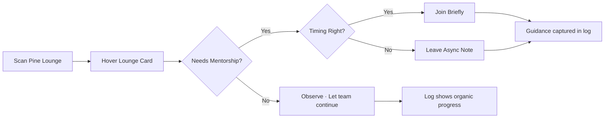
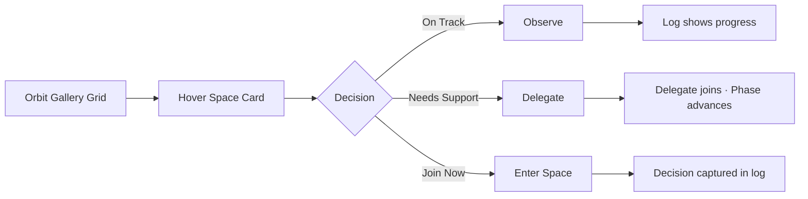
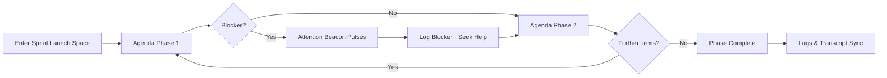

# {{project_name}} UX Design Specification

_Created on {{date}} by {{user_name}}_
_Generated using BMad Method - Create UX Design Workflow v1.0_

---

## Executive Summary

Virtual Office is evolving into a modern, cozy spatial workspace where every space—team hubs, presentation zones, lounges, and ad-hoc war rooms—broadcasts its live story at a glance. Leaders and teammates can see conversations unfolding, energy shifting, and critical moments (from Scrum lessons to strategy summits to lunch breaks) without drilling in. Communication flows through spaces with expressive avatars, status-rich signals, and ambient cues that make coordination effortless. Each interaction is logged so admin dashboards, meeting summaries, and historical insights can replay the company pulse long after the moment passes.

---

## 1. Design System Foundation

### 1.1 Design System Choice

Double down on the current shadcn/ui + Radix stack, enriching it with a bespoke cozy theme and spatial components rather than introducing a new system. This keeps accessibility and headless flexibility intact while letting us craft organic space cards, avatar clusters, and ambient status indicators that wrap around photo-based avatars. We’ll extend Tailwind tokens (colors, elevation, gradients) to support the island-inspired moods and ensure every interactive element inherits consistent focus/hover treatments across web and future responsive breakpoints.

---

## 2. Core User Experience

### 2.1 Defining Experience

Leadership and teammates land on the floor plan and instantly parse what every space is doing right now: team hubs glow when a stand-up starts, presentation zones display live agenda tags, kitchen lounges show casual chatter. Ambient beacons (color halos, motion pulses, light projections) translate the activity level, while avatar clusters highlight who’s present, who’s speaking, and who’s observing. A shared “now board” distills the heartbeat into a top-level summary bar so no one feels lost—even when dozens of spaces are alive at once. Champions brag about how they can spot the Strategy War Room spinning up and hover to reveal the live participant roster, agenda phase, activity log, and transcript snippet before they even step inside.

### 2.2 Novel UX Patterns

Introduce spatial storytelling patterns that go beyond rectangular rooms:
1. Zoned “neighborhood bands” that use subtle color gradients and lighting to group related spaces (product org, customer org, social) while preserving architectural clarity.
2. Status ribbons and phase trackers wrapping each space, changing texture based on meeting type (focus, collaborative, social) and showing the current agenda stage.
3. Avatar constellations that reposition automatically to prevent overlap, with micro-animations conveying talkers vs. listeners and tap targets that surface inline activity logs.
4. “Summon beams” that appear when a company-wide event kicks off, guiding users from their current space into the highlighted zone without feeling disruptive.
5. Persistent activity trails and transcript peeks that show where major events happened in the last few hours for asynchronous catch-up.
6. Dynamic overview mode that condenses spaces into a Sococo-inspired matrix without losing ambient cues—status ribbons, avatar constellations, and beacons scale down gracefully so 15+ spaces remain legible at once.

---

## 3. Visual Foundation

### 3.1 Color System

Craft a palette that balances efficiency, coziness, and inspiration:
- **Midnight Slate (#1E2330)** as the base canvas—calming and professional, ideal for dimming background noise.
- **Aurora Ember (#FF8A5C)** for high-priority attention beacons—warm energy that signals action without stress.
- **Soft Pine Mist (#6FB7A5)** for collaborative spaces—fresh, breathable, and reinforces calm focus.
- **Golden Thread (#F1C550)** as the accent for phase trackers and success states—sparks optimism and strategic momentum.
- **Ivory Glow (#FAF6EF)** for card surfaces and log panels—keeps the interface cozy and legible.
Each color ships with Tailwind tokens (e.g., `--vo-slate-900`, `--vo-ember-500`) plus semantic aliases like `--vo-signal-critical` to keep implementation consistent. Warm Control anchors the light theme (daytime leadership scans) and Cosmic Efficiency anchors the dark theme (executive focus mode); Orbit Gallery toggles reuse the same semantic token names so components inherit the correct mood automatically.

### 3.2 Typography

- **Headings:** "Satoshi" (or fallback `Inter`) in 600 weight, tight letter-spacing for control-center clarity. h1 44/52, h2 34/42, h3 26/32.
- **Body:** `Inter` 400 weight at 16/24 with 18/28 for dense logs. Small text 14/22 for metadata and timestamps.
- **Monospace:** `JetBrains Mono` for transcript snippets and token previews.
- Apply OpenType slashed-zero + tabular numbers for analytics-heavy panels.

### 3.3 Spacing & Layout

- Base unit: 4px grid with 12px/16px increments for macro spacing (16, 20, 24, 32, 40, 48).
- Layout grid: 12-column responsive, 80px gutters at >1440px, 48px at 1024px, 24px at 768px.
- Card padding defaults: 20px desktop, 16px tablet, 12px mobile.
- Hover reveal panels expand with 24px padding and 12px corner radius.

**Interactive Visualizations:**

- Color Theme Explorer: [ux-color-themes.html](./ux-color-themes.html)

---

## 4. Design Direction

### 4.1 Chosen Design Approach

Blend modern control center clarity with cozy hospitality cues, anchored in the Orbit Gallery direction for everyday leadership scans and paired with the Space Grid overview (Orbit Gallery layout) when occupancy crosses 15 spaces. Command Atrium and Analyst Matrix remain reference variants in the grid lab:
- Floor plan framed by a “now board” header and smart filters on the left, keeping the main canvas wide and breathable.
- Spaces rendered as elevated cards with rounded geometry, soft drop shadows, and light gradient washes keyed to their neighborhood band. When 15+ spaces are active, the canvas auto-switches into a zoomed-out Orbit Gallery grid so leadership still sees every space in one glance (inspired by Sococo, but with richer cues and higher fidelity).
- Avatars remain photo-forward, encircled by animated status rings (speaking, presenting, listening) and stacked in constellations that adapt to attendance.
- Hover reveals expand gracefully: translucent overlays surface agenda phase, recent log entries, and the latest transcript snippet without blocking surrounding content.
- Motion is purposeful: gentle pulses for live events, magnetic slides when people join/leave, and glowing trails when attention beacons fire for all-company moments.

**Interactive Mockups:**

- Design Direction Showcase: [ux-design-directions.html](./ux-design-directions.html)

---

## 5. User Journey Flows

### 5.1 Critical User Paths

{{user_journey_flows}}
1. **Leader Command Path:** CEO opens Virtual Office → spots attention beacon on Strategy War Space → hover reveals roster, phase, transcript → click to join or delegate.
2. **Team Sync Loop:** Product squad enters Sprint Launch space → agenda auto-advances phases → log captures key decisions → summary pushes to admin dashboard.
3. **Ad-hoc Coaching:** Mentor notices Pine Lounge chatter → hover to preview conversation → joins if needed → leaves note for async follow-up → log records for later review.

**Ad-hoc Coaching — Presence Without Micromanaging**
- Entry: Pine Lounge sits in the Culture neighborhood, often without alerts; mentor glances at the avatar constellation and soft status ribbons as part of a routine sweep.
- Hover intel: Transcript snippet and log reveal whether the chat is casual or beginning to touch sensitive topics; mentor identifies if guidance is needed.
- Branches:
  - Observe quietly when the team is bonding or resolving issues without help.
  - Drop in briefly when mentorship is useful, ensuring hover intel signaled confusion or escalation.
  - Leave async notes if timing isn’t right, tagging takeaways in the log for later follow-up.
- Success: Mentor sees the log capturing their guidance or observes that the group progressed unaided; Supabase record ensures the interaction informs later coaching.

**Leader Command Path — Adaptive Presence**
- Entry: Orbit Gallery overview with attention beacons; Sarah scans for Aurora Ember pulses.
- Hover intel: Avatar constellation, agenda phase tracker, transcript snippet, and activity log determine whether to observe, delegate, or join.
- Success: Delegated teammate appears in the constellation or log shows progress without intervention; if Sarah joins, a captured decision follows her clarification.

**Team Sync Loop — Auto-Advancing Cadence**
- Entry: Sprint Launch space highlights collaborative status; avatar constellation fills as teammates arrive.
- Input: Agenda auto-starts when quorum is detected; animated status rings follow speakers while transcript and log capture notes automatically.
- Feedback: Phase tracker shows current agenda item, log records decisions, and attention beacon fires if a blocker stalls progress; team can acknowledge and advance the tracker once resolved.
- Success: Phase tracker completes final agenda stage, logs sync to admin dashboard, and Supabase stores transcript for asynchronous follow-up.

---

## 6. Component Library

### 6.1 Component Strategy

{{component_library_strategy}}
- Extend shadcn/Radix primitives into a Virtual Office kit:
  - `SpaceCard` component with gradient bands, status ribbons, hover reveal container, and configurable attention beacon slots.
  - `AvatarConstellation` layout that arranges real-photo avatars dynamically, layering animated status rings and tooltips for agenda roles.
  - `NowBoard` header module showing live priorities, filters, and key metrics.
  - `ActivityLogPanel` and `TranscriptPeek` components using Ivory Glow surfaces and timeline markers.
  - `AttentionBeacon` micro-component providing pulse animations and logging hooks for admin systems.
  - `SpaceGridOverview` responsive mosaic that preserves full-office visibility (15+ spaces) while retaining per-space status ribbons and beacon cues.

**Reuse & Build Notes**
- `SpaceElement.tsx` already powers individual rooms; we will refactor it into the Orbit Gallery `SpaceCard` by swapping the color utility for token-driven gradients, adding agenda/phase ribbons, hover transcript panels, and attention beacon slots.
- `UserAvatarPresence.tsx` and related avatar helpers form the base of `AvatarConstellation`; enhancements include animated status rings, speaker/observer variants, and clustering for 8+ participants.
- `floor-plan.tsx` and `NowBoard` logic (currently implicit in dashboard headers) will surface as the dedicated `NowBoard` module with filters and attention summaries.
- `message-dialog` and log utilities plug into `ActivityLogPanel` / `TranscriptPeek`; we’ll expose them as reusable panels that stream Supabase data.
- Attention beacon behavior lives today in highlight flags—upgrade this into a dedicated `useAttentionBeacon` hook feeding both Orbit Gallery cards and the grid overview.
- `space-debug-panel.tsx` already lists rooms; it becomes the scaffold for `SpaceGridOverview`, sharing data loaders while adopting the new Orbit layout styles.

**Component Specs**
- `SpaceCard` (extends `src/components/floor-plan/SpaceElement.tsx`)
  - Purpose: Showcase a single space with agenda phase, participants, and attention state in Orbit Gallery.
  - Anatomy: Title + org badge, status ribbon, phase tracker pill, avatar cluster, hover panel (roster, log, transcript), beacon slot.
  - States: Default, hover reveal, live beacon (animated border), focus (keyboard), loading (skeleton), empty (no participants).
  - Behavior: Click enters space, double-click opens detailed dialog, hover fetches log/transcript snapshot, beacon pulses when attention rule triggers.
  - Accessibility: `role="button"`, label announced as “Space ‹name›, ‹phase›, ‹participants count›”; keyboard activation via Enter/Space.

- `AvatarConstellation` (extends `src/components/floor-plan/UserAvatarPresence.tsx`)
  - Purpose: Visualize up to 12 active participants with photo avatars, speaker emphasis, and overflow handling.
  - Anatomy: Primary ring (speaker), secondary ring (listener), stacked overflow badge, tooltip with presence details.
  - States: Speaking (glow/pulse), listening, observer (dimmed), offline (gray silhouette), overflow collapsed.
  - Behavior: Auto-sorts by activity timestamp, animates transitions, exposes data attributes for hover analytics.
  - Accessibility: Announce name + role via tooltip/screen reader; ensure 44px touch target on responsive breakpoints.

- `NowBoard` (implemented in `src/components/floor-plan/floor-plan.tsx` header region)
  - Purpose: Provide leadership with instant metrics—active beacons, top spaces, filters.
  - Anatomy: Title, filter chips, beacon queue list, quick actions (delegate, join), timestamp.
  - States: Default, filter applied, empty (no beacons), high-alert (critical events prioritized).
  - Behavior: Selecting a beacon focuses the corresponding `SpaceCard`; filters persist per session via Supabase profile settings.
  - Accessibility: Sections labelled by `aria-labelledby`; live region for new beacon announcements.

- `AttentionBeacon` (new utility hook + badge)
  - Purpose: Normalize the rules that raise attention states (phase stalls, attendance spikes, blockers logged).
  - Anatomy: Hook `useAttentionBeacon(spaceId)` returning status, severity, last change; badge component renders color ring + label.
  - States: Idle, info, warning, critical; includes snoozed state for dismissed alerts.
  - Behavior: Debounces duplicate pings, syncs to Supabase logs, feeds HUD notifications.
  - Accessibility: Screen reader announces severity + reason when badge appears; provide keyboard action to snooze.

- `ActivityLogPanel` / `TranscriptPeek` (extend existing log dialog components)
  - Purpose: Surface the latest decisions and transcript lines inline with each space.
  - Anatomy: Timestamp, author, summary chip, transcript snippet with highlight.
  - States: Default list, loading (skeleton rows), empty (prompt to start logging), error (retry CTA).
  - Behavior: Fetches on hover with caching; supports scroll for deeper history; writes to Supabase when mentoring notes added.
  - Accessibility: Ensure list items read “‹time› — ‹author› — ‹summary›”; transcripts exposed via aria-describedby.

- `SpaceGridOverview` (enhances `space-debug-panel.tsx`)
  - Purpose: Show 15+ spaces simultaneously with Orbit Gallery styling, theme toggles, and layout switches.
  - Anatomy: Theme/layout controls, Masonry grid, compact `SpaceCard` variant, footer guidance.
  - States: Default (Warm Control), dark mode (Cosmic Efficiency), command vs orbit vs analyst layouts, loading (skeleton cards).
  - Behavior: Auto-activates when active space count > 15, inherits filter state from `NowBoard`, exposes keyboard grid navigation.
  - Accessibility: Grid implements roving tabindex; theme/layout buttons grouped with `aria-pressed` updates.

---

## 7. UX Pattern Decisions

### 7.1 Consistency Rules

{{ux_pattern_decisions}}
- Hover reveals must surface roster, agenda phase, activity log, and transcript snippet in a consistent hierarchy: roster first, phase tracker second, log entries third, transcript preview last.
- Attention beacons trigger when >60% of a space seats fill or when agenda phases change unexpectedly; they log events automatically.
- Summon beams only activate for company-wide or exec-flagged spaces and include a dismiss + snooze control to avoid interrupt overload.
- Avatar constellations maintain minimum 8px separation, prioritize speaker prominence, and collapse gracefully under 360px width.
- All logs and transcripts stream to Supabase tables with metadata timestamps for admin dashboards and meeting summaries.
- Button hierarchy: Primary buttons use Aurora Ember background with dark text; secondary surface is Ivory Glow outline; tertiary is ghost link. Destructive actions adopt deep rose (`--vo-destructive-500`) with confirmation tooltip when triggered from Orbit Gallery.
- Feedback patterns: Success uses inline badges within ActivityLogPanel plus optional toast; errors surface inline with retry CTA; loading employs skeleton cards for SpaceCard and progress shimmer for transcript peek.
- Form patterns: Labels sit above fields, required fields marked with `*` and aria-required, validation on blur for text inputs and on submit for multi-step flows, inline error helper text.
- Modal patterns: Large modal for room management, medium for mentoring notes, small for confirmations; all support escape and explicit close, focus trap with first actionable element autofocus.
- Navigation patterns: Active routes highlighted in NowBoard filters with pill treatment; browser back honored, app-level back buttons only when context differs from history.
- Empty states: First-use surfaces coaching copy plus CTA, no-results provide suggestions, cleared content offers undo for 10 seconds via toast.
- Confirmation patterns: Deletions require confirm dialog (unless undo available), leaving unsaved settings prompts modal, irreversible actions double-confirm with typed keyword for safety.
- Notification patterns: Toast stack top-right, success auto-dismiss 4s, warnings linger until dismissed, critical beacons escalate to NowBoard list.
- Search patterns: Orbit Gallery search triggers on enter with highlighted matches; filters live in NowBoard chips; zero results show alternative spaces and ability to create new.
- Date/time patterns: Default to relative (“5 min ago”) with tooltip absolute timestamp; system stores UTC, displays in user locale.

---

## 8. Responsive Design & Accessibility

### 8.1 Responsive Strategy

Device priorities:
- **Desktop ≥1440px:** Orbit Gallery spans 3–4 columns; NowBoard and beacon queue stay pinned; ActivityLogPanel can remain open alongside grid.
- **Tablet 1024–1439px:** Grid collapses to two columns with stacked hover sheets; filters condense into horizontal chips; tap targets expand to 48px.
- **Mobile ≤1023px:** Single-column feed of compact SpaceCards, bottom sheet reveals hover intel, bottom navigation surfaces quick join/delegate actions.

Breakpoints & layout:
- `≥1440px`: 12-column grid, persistent sidebar filters, inline log/transcript panel.
- `1024–1439px`: 8-column grid, collapsible filter drawer, modal log/transcript.
- `768–1023px`: 6-column grid, stacked cards, tap-to-expand hover intel.
- `<768px`: 4-column base, single-card list, floating action button for join/delegate.

Interaction & accessibility:
- Keyboard order always runs NowBoard → filters → space grid → hover details → footer; shortcuts (`G` go-to grid, `B` toggle beacons) accelerate leadership tasks.
- Space grid implements roving tabindex with arrow-key navigation; focus ring uses Orbit highlight token.
- Screen reader announcement: “Space ‹name›, agenda ‹phase›, ‹count› participants, beacon ‹status›” with `aria-live="polite"` updates on beacons and log changes.
- Reduced motion setting disables beacon pulses and swaps avatar animations for subtle opacity changes; high contrast swaps gradients for solid tokens.
- Transcript and decision updates stream to `aria-live` regions inside ActivityLogPanel; captions available for all transcript snippets.
- WCAG target: 2.1 Level AA. Contrast ratio ≥4.5:1 for text, ≥3:1 for UI components; 44px minimum touch targets. Automated checks via Lighthouse + axe DevTools, manual keyboard sweeps, and VoiceOver/NVDA smoke tests in QA.

---

## 9. Implementation Guidance

### 9.1 Completion Summary

{{completion_summary}}
- Floor plan UX centers on instant situational awareness for leaders and teammates through ambient cues, hover reveals, and attention beacons.
- Cozy, inspired visuals come from a tailored shadcn/Radix theme with Midnight Slate base, Aurora Ember signals, and Ivory Glow surfaces.
- Dual-theme support combines Warm Control (light default) and Cosmic Efficiency (dark default) so leadership can work in daylight or focused executive mode without losing semantic color meaning.
- Core journeys (leader command, team sync, ad-hoc coaching) are supported by SpaceCard, AvatarConstellation, NowBoard, ActivityLogPanel, and AttentionBeacon components.
- All interactions log to Supabase-backed dashboards and transcripts, ensuring today’s pulse becomes tomorrow’s intelligence.

**Immediate Implementation Actions**
- Draft build specs for Orbit Gallery components (`SpaceCard`, `AvatarConstellation`, `NowBoard`, `AttentionBeacon`, `SpaceGridOverview`) including props, token usage, and Supabase data contracts.
- Produce mid-fidelity Orbit Gallery wireframes (overview → hover → join) in Warm Control to validate hierarchy before development.
- Add backlog tickets covering theme toggles, grid activation logic, hover logging, and Cosmic Efficiency styling so engineering can slot the work.

---

## Appendix

### Related Documents

- Product Requirements: `{{prd_file}}`
- Product Brief: `{{brief_file}}`
- Brainstorming: `{{brainstorm_file}}`

### Core Interactive Deliverables

This UX Design Specification was created through visual collaboration:

- **Color Theme Visualizer**: [ux-color-themes.html](./ux-color-themes.html)
  - Interactive HTML showing all color theme options explored
  - Live UI component examples in each theme
  - Side-by-side comparison and semantic color usage

- **Design Direction Mockups**: [ux-design-directions.html](./ux-design-directions.html)
  - Interactive HTML with 6-8 complete design approaches
  - Full-screen mockups of key screens
  - Design philosophy and rationale for each direction
- **Space Grid Overview**: [ux-space-grid.html](./ux-space-grid.html)
  - Toggle between Warm Control (light default) and Cosmic Efficiency (dark default) while viewing 16 concurrent spaces
  - Orbit Gallery layout showcased as the primary condensed view; Command Atrium and Analyst Matrix remain as comparison toggles
  - Highlights avatars, agenda phases, beacons, and log snippets in condensed view
- **Orbit Gallery Showcase**: [ux-final-app-showcase.html](./ux-final-app-showcase.html)
  - Six Warm Control vs Cosmic Efficiency screens covering NowBoard, grid, delegation, sprint cadence, admin settings, and empty states
  - Theme toggle baked in for stakeholders to preview both palettes alongside the Orbit layout decisions

### Optional Enhancement Deliverables

_This section will be populated if additional UX artifacts are generated through follow-up workflows._

<!-- Additional deliverables added here by other workflows -->

### Next Steps & Follow-Up Workflows

This UX Design Specification can serve as input to:

- **Wireframe Generation Workflow** - Create detailed wireframes from user flows
- **Figma Design Workflow** - Generate Figma files via MCP integration
- **Interactive Prototype Workflow** - Build clickable HTML prototypes
- **Component Showcase Workflow** - Create interactive component library
- **AI Frontend Prompt Workflow** - Generate prompts for v0, Lovable, Bolt, etc.
- **Solution Architecture Workflow** - Define technical architecture with UX context

### Version History

| Date     | Version | Changes                         | Author        |
| -------- | ------- | ------------------------------- | ------------- |
| {{date}} | 1.0     | Initial UX Design Specification | {{user_name}} |

---

_This UX Design Specification was created through collaborative design facilitation, not template generation. All decisions were made with user input and are documented with rationale._
