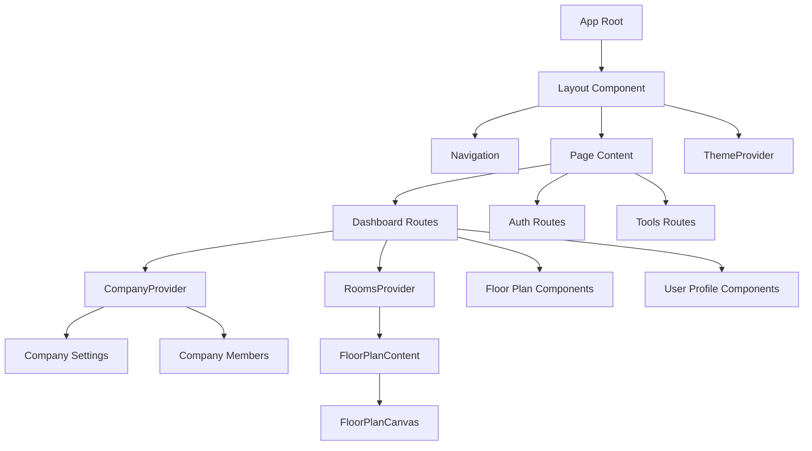
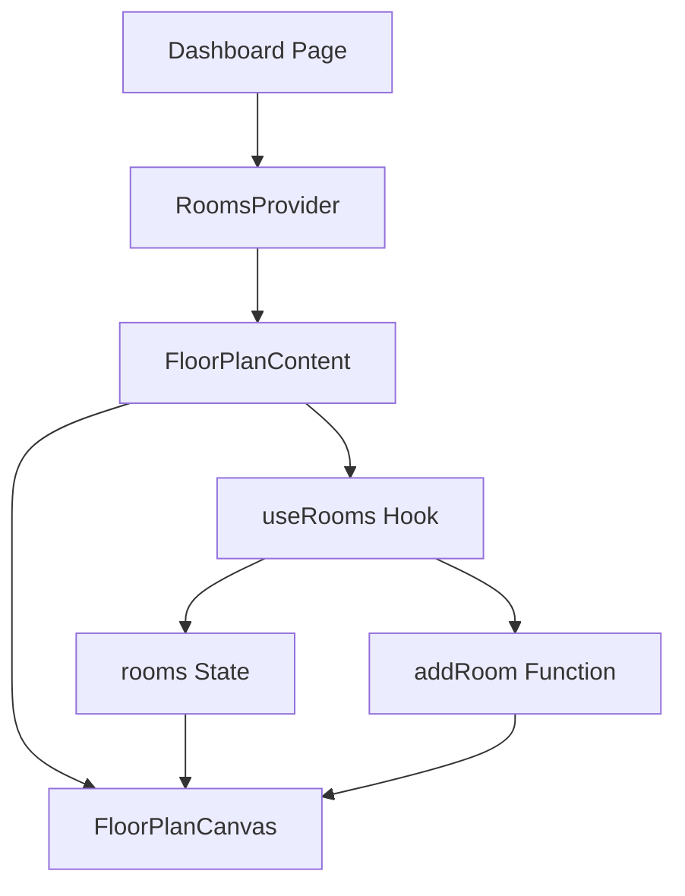

# System Patterns

## System Architecture

The Virtual Office application follows a modern web architecture with the following key components:

### Frontend Architecture
- **Next.js**: Server-side rendering and static site generation for better performance and SEO
- **React.js**: Component-based UI development with functional components and hooks
- **TypeScript**: Strong typing for improved code quality and developer experience
- **Tailwind CSS with shadcn/ui**: Utility-first CSS framework with pre-built accessible components
- **Client-Side State Management**: React Context API for state management (AuthContext, CompanyContext, SearchContext, RoomsContext)

### Backend Architecture
- **Next.js API Routes**: Serverless functions for backend logic
- **AWS DynamoDB**: NoSQL database with Global Secondary Indexes
- **Firebase Authentication**: User authentication and session management
- **AWS SDK for JavaScript**: Server-side integration with AWS services

### Infrastructure
- **Vercel**: Deployment and hosting platform for Next.js applications
- **AWS Services**: Configuration through environment variables for server-side only
- **Firebase Project**: Authentication and planned database services

## Key Technical Decisions

### 1. Authentication Strategy
- **Firebase Authentication**: Chosen for ease of implementation, security, and support for multiple authentication methods (email/password, OAuth)
- **Server-Side Validation**: JWT verification on API routes using Firebase Admin SDK
- **Client-Side Auth Context**: Centralized authentication state management

### 2. Database Selection
- **Current: AWS DynamoDB**: Initial implementation
- **Schema Design**: Collections for companies, users, rooms, messages, announcements, and meeting notes
- **Security Rules**: Company-based access control for data isolation

### 3. API Strategy
- **REST API**: API routes implementing RESTful principles
- **Repository Pattern**: Abstraction over data access layer
- **API Client**: Centralized API functions in `/lib/api.ts` rather than direct database access from components

### 4. UI Framework
- **Tailwind CSS with shadcn/ui**: Component library with consistent design system
- **Responsive Design**: Mobile-first approach for multi-device support
- **Dark/Light Mode**: Theme support with ThemeProvider

### 5. Real-Time Features
- **Planned WebRTC**: For audio/video communication
- **Planned Socket.io**: For real-time user presence and messaging

## Design Patterns in Use

### 1. Repository Pattern
- Abstracted data access through API client functions
- Centralized in `/lib/api.ts` 
- Isolates database implementation details from business logic

### 2. Context Provider Pattern
- `AuthContext`: Manages user authentication state
- `CompanyContext`: Manages company and user data
- `SearchContext`: Manages global search functionality
- `RoomsContext`: Manages room data and operations
- Each context exposes hooks (useAuth, useCompany, useRooms) for component access

### 3. Container/Presentation Pattern
- Separation of data fetching (containers) from rendering (presentation)
- Example: Dashboard shell components vs. specific feature components
- Example: FloorPlanContent (context consumer) vs. FloorPlanCanvas (presentation)

### 4. Higher-Order Components
- Protected routes implementation with `useProtectedRoute` hook
- Adds authentication checks to routes that require user login

### 5. Custom Hooks
- `useNotification`: Manage user notifications
- `useProtectedRoute`: Authentication protection for routes
- `useRooms`: Access and manage room data

### 6. Component Composition Pattern
- Breaking down complex UIs into smaller, focused components
- Example: Dashboard page composed of DashboardHeader, CompanyOverviewCard, QuickLinksGrid, and FloorPlanContent
- Enhances reusability and maintainability

### 7. Prop Enhancement Pattern
- Enhancing components with additional props for flexibility
- Example: DashboardHeader with optional heading and description props
- Maintains backward compatibility while adding new functionality

## Component Relationships

### Core Structure

### Authentication Flow

### Data Flow

### Floor Plan Component Flow

## UI Component Structure

### Shell Components
- `DashboardShell`: Main layout container for dashboard pages
- `DashboardHeader`: Consistent header for dashboard pages with optional heading and description props

### Feature Components
- Floor Plan: Interactive office layout with rooms and users
  - `FloorPlanCanvas`: Presentational component for rendering rooms
  - `FloorPlanContent`: Container component that integrates with RoomsContext
- Company Management: Settings and user management
  - `CompanyOverviewCard`: Displays company information with proper type safety
- User Profile: Avatar and status management
- Message Feed: Company and direct messaging

### UI Components
- Based on shadcn/ui library
- Extended with custom components (StatusAvatar, etc.)

## Planned Technical Evolution

1. **DynamoDB Enhancements**: Optimize and scale database operations with DynamoDB
2. **Real-Time Communication**: Integrate WebRTC and Socket.io for live interaction
3. **DynamoDB Streams**: Implement real-time data synchronization with DynamoDB Streams
4. **AI Integration**: Add speech-to-text, translation, and meeting notes features
5. **Performance Optimization**: Implement caching and optimize rendering
